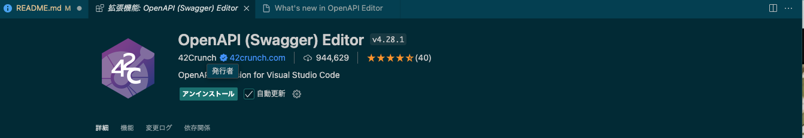
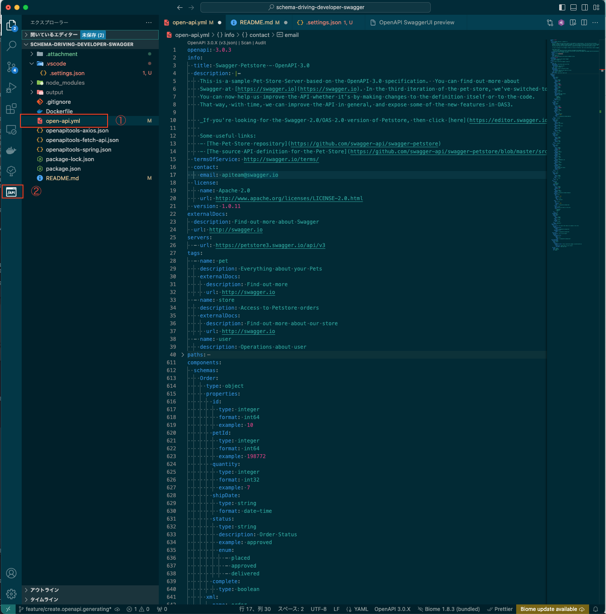
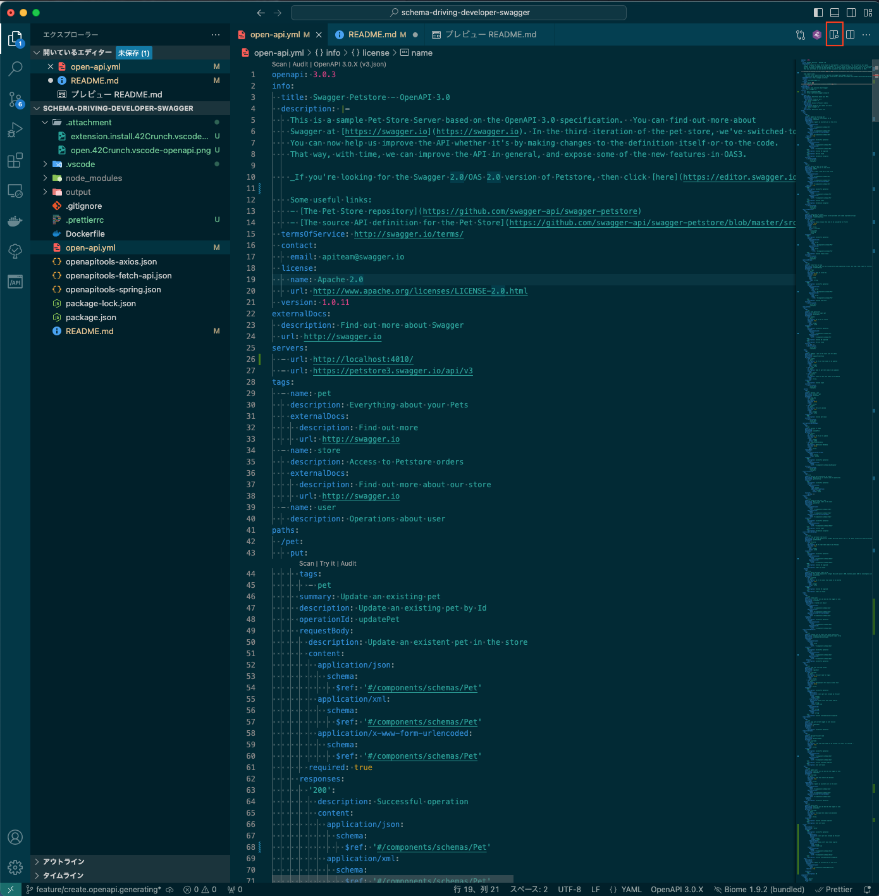
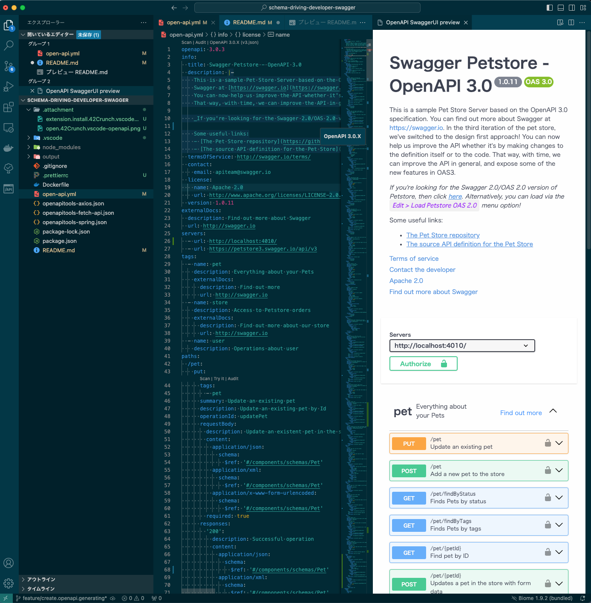
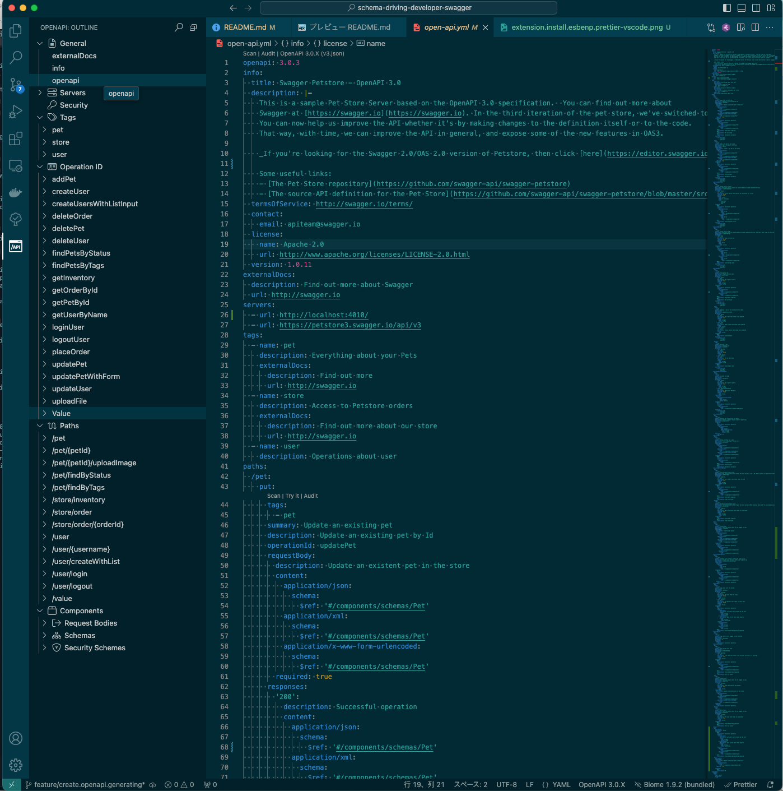

# schema-driving-developer-swagger

- Swagger を使って RestAPI スキーマ駆動開発

## OpenApi Mock Build Container Start

### build && mock server start

```sh
 docker build -t openapi-tools .
 docker run --name openapi-mock-server  -d -p 4010:4010 -v$(pwd):/workspace openapi-tools
```

## curl mock server request

```sh
curl -X 'POST' \
  'http://localhost:4010/user' \
  -H 'accept: application/json' \
  -H 'Content-Type: application/json' \
  -d '{
  "id": 10,
  "username": "theUser",
  "firstName": "John",
  "lastName": "James",
  "email": "john@email.com",
  "password": "12345",
  "phone": "12345",
  "userStatus": 1
}'
```

## OpenAPI Generator Command Lines

```sh
# typescript/fetch
docker exec openapi-mock-server openapi-generator-cli generate -c /workspace/openapitools-fetch-api.json -o /workspace/output/typescript/fetch
# typescript/axios
docker exec openapi-mock-server openapi-generator-cli generate -c /workspace/openapitools-axios.json -o /workspace/output/typescript/axios
# java/springboot
docker exec openapi-mock-server openapi-generator-cli generate -c /workspace/openapitools-spring.json -o /workspace/output/java
```

## Yml Editor

### Visual Studio Code Extension Install

```sh
code --install-extension 42Crunch.vscode-openapi
code --install-extension esbenp.prettier-vscode
```

### UI Extension Install

- 42Crunch.vscode-openapi
  
- esbenp.prettier-vscode
  

## Explanation Extension 42Crunch.vscode-openapi

### 拡張機能で追加した 42Crunch.vscode-openapi を開く

- ① Swagger の Yaml ファイルを開き
- ② 左アイコンの[/API]を選択
  

### Swagger View を展開

- Swagger の Yaml ファイルを開いたら左から 3 番目のアイコンをクリック
  

- Swagger View が開くので見ながら API 設計書を作成する
  

### 細かな機能

- 左メニューの[OPENAPI:OUTLINE]で効率的にスキーマを生成することが可能
- 詳細は VScode の拡張機能マーケットプライスに記載されております。 [OpenAPI (Swagger) エディター](https://marketplace.visualstudio.com/items?itemName=42Crunch.vscode-openapi)
  
